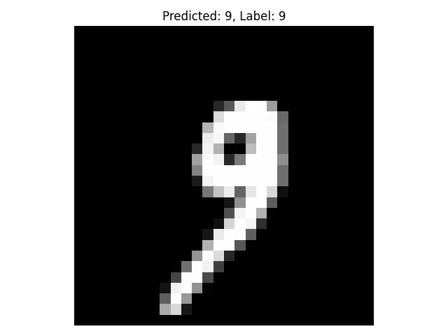

# # Neural Network definition and training with Python and TensorFlow
## [Back to index](index.md)

Requirements:
- Python3

TensorFlow provides a simple and efficient way to load the MNIST dataset directly in Python, without needing to manually download and parse the raw IDX files.

### Required Python Packages

Make sure you have the following packages installed:

- `tensorflow` 2.11
- `tensorflow-datasets` (optional, for other datasets)
- `keras` 2.11
- `numpy` <2

You can install them using pip:

```pip install tensorflow tensorflow-datasets```


### Reading MNIST dataset
#### A) Reading MNIST from file

Import all the necessary packages:
```python
import numpy as np
import struct
import matplotlib.pyplot as plt
```
Reading MNIST dataset:
```python
# Function to read MNIST data
def read_images(filename):
    with open(filename, 'rb') as f:
        magic, num, rows, cols = struct.unpack(">IIII", f.read(16))
        images = np.frombuffer(f.read(), dtype=np.uint8).reshape(num, rows, cols)
    return images

# Function to read MNIST labels
def read_labels(filename):
    with open(filename, 'rb') as f:
        magic, num = struct.unpack(">II", f.read(8))
        labels = np.frombuffer(f.read(), dtype=np.uint8)
    return labels

# Read files
train_data = read_images("data/train-images.idx3-ubyte")
train_labels = read_labels("data/train-labels.idx1-ubyte")
test_data = read_images("data/t10k-images.idx3-ubyte")
test_labels = read_labels("data/t10k-labels.idx1-ubyte")
```

#### B) Reading MNIST dataset from TF
TensorFlow provides a simple method for Python to use the MNIST dataset.

```python
import tensorflow as tf
(train_data, train_labels), (test_data, test_labels) = tf.keras.datasets.mnist.load_data()
```
#### Display relevant dataset information
```python
print('Train data length: ', len(train_data), 'images')
print('Train labels length: ', len(train_labels), 'labels')
print('Test data length: ', len(test_data), 'images')
print('Test labels length: ', len(test_labels), 'labels')
print('Data format: ', train_data[0].shape )
print('Train data shape:', train_data.shape)
print('Test data shape:', test_data.shape)
print('First label: ', train_labels[0])
print('Pixel value range:', train_data.min(), 'to', train_data.max())
print('Unique labels:', np.unique(train_labels))
```

#### Display 10 MNIST training images with their labels
```python
# Show 10 MNIST training images with their labels
fig, axes = plt.subplots(2, 5, figsize=(10, 5))
for i, ax in enumerate(axes.flat):
    ax.imshow(train_data[i], cmap='gray')
    ax.set_title(f"Label: {train_labels[i]}")
    ax.axis('off')
plt.tight_layout()
plt.show()
```


#### Normalize data
Data must be normalized in range 0 to 1 (float):
```python
def normalize_img(image, label):
  """Normalizes images: `uint8` -> `float32`."""
  return tf.cast(image, tf.float32) / 255., label

print('Raw data pixel value range:', train_data.min(), 'to', train_data.max())
train_data, train_labels = normalize_img(train_data, train_labels)
test_data, test_labels = normalize_img(test_data, test_labels)

print('Normalized datatye: ', type(train_data))
print('Normalized data pixel value range:', train_data.numpy().min(), 'to', train_data.numpy().max())
```
Output:
```
Raw data pixel value range: 0 to 255
Normalized datatye:  <class 'tensorflow.python.framework.ops.EagerTensor'>
Normalized data pixel value range: 0.0 to 1.0
```


### Defining model with TF and keras

[Keras](https://keras.io/) is a high-level deep learning API written in Python and capable of running on top of TensorFlow, Microsoft Cognitive Toolkit, Theano, or PlaidML. It was developed to enable fast experimentation with deep neural networks and is now tightly integrated with TensorFlow as its official high-level API.
Keras is widely used because it is:

- User-friendly: It provides a simple and intuitive interface for building and training neural networks.
- Modular: Models are made by connecting configurable building blocks like layers, optimizers, and loss functions.
- Extensible: You can easily create custom layers, metrics, and other components.
- Efficient: It supports GPU acceleration and distributed training through TensorFlow.

Thanks to its simplicity and flexibility, Keras is ideal for beginners and professionals alike who want to prototype and deploy deep learning models quickly.

TensorFlow model will be defined with Keras API and ``Sequential``. The ``Sequential`` API in TensorFlow is a simple way to build neural networks layer by layer. It’s ideal when your model has a linear stack of layers, meaning each layer has exactly one input tensor and one output tensor, and they are connected in order.

#### FullyConnected (FC)
- Input layer: [Flatten](https://keras.io/api/layers/reshaping_layers/flatten/)
  - Converts the 2D image (28x28 pixels) into a 1D vector of 784 elements.
  - This is necessary before feeding the data into dense layers.
- [Dense](https://keras.io/api/layers/core_layers/dense/)
  - A fully connected layer with 'units' neurons.
- Output layer: [Dense](https://keras.io/api/layers/core_layers/dense/) with N class neurons and ['Softmax'](https://keras.io/api/layers/activation_layers/softmax/) activation layer
  - Output layer with 10 neurons (one for each digit class).
  - Softmax activation converts outputs into probabilities.

```python
model = tf.keras.Sequential([
        tf.keras.layers.Flatten(input_shape=input_shape),
        tf.keras.layers.Dense(128, activation='relu'),
        tf.keras.layers.Dense(32,activation='relu'),
        tf.keras.layers.Dense(num_classes,activation='softmax')
    ])
```
#### Convolutional Neural Network (CNN)
- [Conv2D](https://keras.io/api/layers/convolution_layers/convolution2d/)
  - Applies 32 filters of size 3x3 to extract local features.
  - ReLU activation introduces non-linearity.
- [MaxPooling2D](https://keras.io/api/layers/pooling_layers/max_pooling2d/)
  - Reduces spatial dimensions by taking the maximum value in 2x2 windows.
  - Helps reduce computation and control overfitting.
- [Flatten](https://keras.io/api/layers/reshaping_layers/flatten/)
  - Converts the 2D feature maps into a 1D vector for the dense layers.
- [Dense](https://keras.io/api/layers/core_layers/dense/)
  - A fully connected layer with 'units' neurons.
  - Output layer with 10 neurons for classification.

```python
model = tf.keras.Sequential([
        tf.keras.layers.Conv2D(32, (3, 3), activation='relu', input_shape=input_shape),
        tf.keras.layers.MaxPooling2D((2, 2)),
        tf.keras.layers.Conv2D(64, (3, 3), activation='relu'),
        tf.keras.layers.MaxPooling2D((2, 2)),
        tf.keras.layers.Flatten(),
        tf.keras.layers.Dense(64, activation='relu'),
        tf.keras.layers.Dense(num_classes, activation='softmax')
    ])
```
## Training
When training a neural network, several key components define how the model learns and improves:
- Optimizer: An optimizer is an algorithm that adjusts the model’s weights to minimize the loss function. It determines how the model updates its parameters during training. Common optimizers include SGD (Stochastic Gradient Descent), Adam, and RMSprop. Each has its own strategy for navigating the loss landscape efficiently. [Adam](https://keras.io/api/optimizers/adam/) (Adaptive Moment Estimation) is used in this example
- [Loss function](https://keras.io/api/losses/): The loss function measures how far the model’s predictions are from the actual target values. It provides a signal that the optimizer uses to improve the model. The choice of loss function depends on the type of problem (e.g., classification, regression). For example, [``sparse_categorical_crossentropy``](https://keras.io/api/losses/probabilistic_losses/#sparsecategoricalcrossentropy-class) is used for multi-class classification with integer labels.
- [Metrics](https://keras.io/api/metrics/): Metrics are used to evaluate the performance of the model during training and testing. Unlike the loss function, metrics are not used to update the model but to monitor its progress. Accuracy is a common metric for classification tasks. [Accuracy](https://keras.io/api/metrics/accuracy_metrics/#accuracy-class) is used in this example.
- Epochs: An epoch is one complete pass through the entire training dataset. Training for multiple epochs allows the model to learn patterns more effectively, but too many epochs can lead to overfitting.

### Compile the TensorFlow model with the training parameters
```python
OPTIMIZER = 'adam'
LOSS_FUNCTION = 'sparse_categorical_crossentropy'
METRICS = ['accuracy']
EPOCS = 5

model.compile(optimizer=OPTIMIZER,
              loss=LOSS_FUNCTION,
              metrics=METRICS)

```

### Display model layers and weights
``summary``class returns layers and weights information:
```python
model.summary()
```
Output:
```
┏━━━━━━━━━━━━━━━━━━━━━━━━━━━━━━━━━┳━━━━━━━━━━━━━━━━━━━━━━━━┳━━━━━━━━━━━━━━━┓
┃ Layer (type)                    ┃ Output Shape           ┃       Param # ┃
┡━━━━━━━━━━━━━━━━━━━━━━━━━━━━━━━━━╇━━━━━━━━━━━━━━━━━━━━━━━━╇━━━━━━━━━━━━━━━┩
│ flatten (Flatten)               │ (None, 784)            │             0 │
├─────────────────────────────────┼────────────────────────┼───────────────┤
│ dense (Dense)                   │ (None, 128)            │       100,480 │
├─────────────────────────────────┼────────────────────────┼───────────────┤
│ re_lu (ReLU)                    │ (None, 128)            │             0 │
├─────────────────────────────────┼────────────────────────┼───────────────┤
│ dense_1 (Dense)                 │ (None, 32)             │         4,128 │
├─────────────────────────────────┼────────────────────────┼───────────────┤
│ re_lu_1 (ReLU)                  │ (None, 32)             │             0 │
├─────────────────────────────────┼────────────────────────┼───────────────┤
│ dense_2 (Dense)                 │ (None, 10)             │           330 │
├─────────────────────────────────┼────────────────────────┼───────────────┤
│ Softmax1 (Activation)           │ (None, 10)             │             0 │
└─────────────────────────────────┴────────────────────────┴───────────────┘
 Total params: 104,938 (409.91 KB)
 Trainable params: 104,938 (409.91 KB)
 Non-trainable params: 0 (0.00 B)
```
### Train model
Train model with ``fit`` class:
```python
model.fit(train_data, train_labels, epochs=EPOCHS, validation_data=(test_data, test_labels))
```

### Evaluate model
```python
test_loss, test_acc = model.evaluate(test_data, test_labels, verbose=2)
print(f"Test accuracy: {test_acc:.4f}")
```
[](#get-predictions)
### Get predictions
```python
predictions = model.predict(test_data)
```

### Display test input with predicion and label
```python
# Display prediction i and label
index = 1000
import matplotlib.pyplot as plt
plt.imshow(test_data[index].numpy().squeeze(), cmap='gray')
plt.title(f"Predicted: {np.argmax(predictions[index])}, Label: {test_labels[index]}")
plt.axis('off')
plt.show()
```
Output:




### Export trained model
Save the trained model with trained weights to use it afterwards:
```python
OUTPUT_PATH = Path(f'./../../../saved_model/mnist_{model_type}')
model.save( OUTPUT_PATH / 'model.h5' )
```


## Load exported model
Load previously trained model. It is trained once and it can be used for inference:
```python
from tensorflow.keras.models import load_model
# Define the path where the model is saved
OUTPUT_PATH = Path(f'./../../../saved_model/mnist_{model_type}') 

# Load the model
model = load_model(OUTPUT_PATH / 'model.h5')
```

Once model is loaded, it can be evaluated and used to infer data with [Get predictions](#get-predictions)

