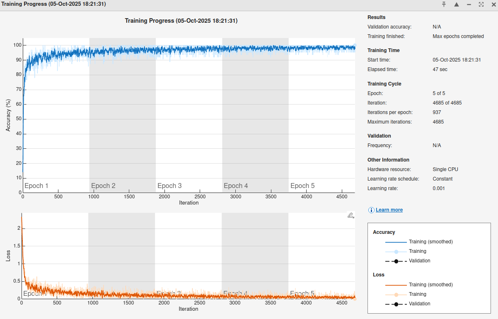
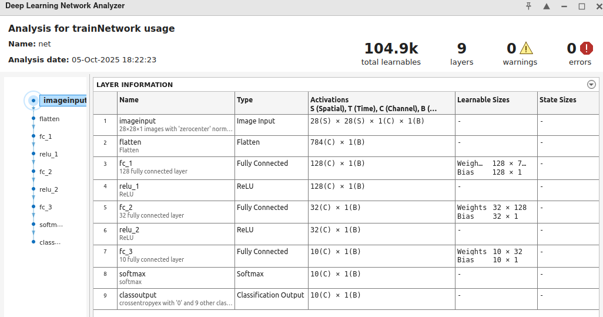

# Neural Network definition and training with MATLAB
## [Back to index](index.md)

## Read MNIST dataset with MATLAB

Downlaod fucntion to load MNIST dat from [
matlab-mnist-two-layer-perceptron
](https://github.com/davidstutz/matlab-mnist-two-layer-perceptron/tree/master): 
- [loadMNISTImages.m](https://github.com/davidstutz/matlab-mnist-two-layer-perceptron/blob/master/loadMNISTImages.m)
- [loadMNISTLabels.m](https://github.com/davidstutz/matlab-mnist-two-layer-perceptron/blob/master/loadMNISTLabels.m)

### MATLAB Script to Read MNIST IDX Files

Set MNIST files path and load them using preous functions:
```matlab
%% MNIST datapath
train_images_file = 'data/train-images.idx3-ubyte';
train_labels_file = 'data/train-labels.idx1-ubyte';
test_images_file  = 'data/t10k-images.idx3-ubyte';
test_labels_file  = 'data/t10k-labels.idx1-ubyte';

%% Load data
train_data = loadMNISTImages(train_images_file);
train_labels = loadMNISTLabels(train_labels_file);
test_data = loadMNISTImages(test_images_file);
test_labels = loadMNISTLabels(test_labels_file);
```
Display dataset relevant information: 
```matlab
fprintf('Train data length: %d images\n', length(train_data));
fprintf('Train labels length: %d labels\n', length(train_labels));
fprintf('Test data length: %d images\n', length(test_data));
fprintf('Test labels length: %d labels\n', length(test_labels));
fprintf('Train data shape: [%d %d %d]\n', size(train_data));
fprintf('Test data shape: [%d %d %d]\n', size(test_data));
fprintf('First label: %d\n', train_labels(1));
fprintf('Pixel value range: %d to %d\n', min(train_data(:)), max(train_data(:)));
fprintf('Unique labels: %s\n', mat2str(unique(train_labels)));
```

Data need to be reshaped to 28x28:
```matlab
%% Reshape input and test data to 28x28
train_data = reshape(train_data, 28, 28, []);
test_data = reshape(train_data, 28, 28, []);

fprintf('Train data shape: [%d %d %d]\n', size(train_data));
fprintf('Test data shape: [%d %d %d]\n', size(test_data));
fprintf('Pixel value range: %d to %d\n', min(train_data(:)), max(train_data(:)));
```

Display 10 MNIST example data:
```matlab
%% Display 10 MNIST examples
figure;
for i = 1:10
    subplot(2,5,i);
    imshow(train_data(:,:,i), []);
    title(sprintf('Label: %d', train_labels(i)));
end
sgtitle('First 10 MNIST Training Images');
```

## Defining model with MATLAB
[MATLAB Deep Learning Toolbox](https://mathworks.com/products/deep-learning.html)

### Fully Connected (FC)
```matlab
layers = [
        imageInputLayer([28 28 1]) % Tamaño de entrada
        flattenLayer
        fullyConnectedLayer(128)
        reluLayer
        fullyConnectedLayer(32)
        reluLayer
        fullyConnectedLayer(numClasses)
        softmaxLayer
        classificationLayer
    ];
```
### Convolutional Neural Network (CNN)
```matlab
layers = [
        imageInputLayer([28 28 1]) % Tamaño de entrada
        flattenLayer
        fullyConnectedLayer(128)
        reluLayer
        fullyConnectedLayer(32)
        reluLayer
        fullyConnectedLayer(numClasses)
        softmaxLayer
        classificationLayer
    ];
```

(Optional) Use ``deepNetworkDesigner`` [Deep Network Designer](https://mathworks.com/help/deeplearning/gs/get-started-with-deep-network-designer.html)


## Create MATLAB Dataset
```matlab
% Reshape [28, 28, 1, 60000] and single datatype
train_data_4D = reshape(train_data, 28, 28, 1, []);
train_data_4D = single(train_data_4D);
train_labels_cat = categorical(train_labels);
trainDataset = augmentedImageDatastore([28 28 1], train_data_4D, train_labels_cat);
```

## Training
Training options:
```matlab
options = trainingOptions('adam', ...
    'MaxEpochs', 5, ...
    'MiniBatchSize', 64, ...
    'Plots', 'training-progress', ...
    'Verbose', false);
```
Train;
```matlab
net = trainNetwork(trainDataset, layers, options);
```
Training progress:



Show NN layers and weights with [``analyzeNetwork``](https://es.mathworks.com/help/deeplearning/ref/analyzenetwork.html):
```matlab
info = analyzeNetwork(net);
```


## Evaluate model
Crate test dataset:
```matlab
% Test dataset
test_data = reshape(test_data, 28, 28, 1, []);
test_data = single(test_data);
test_labels_cat = categorical(test_labels);
testDataset = augmentedImageDatastore([28 28 1], test_data);
```
Predict from test dataset:
```matlab
predicted_labels = classify(net, testDataset);
```

Compute accuracy:
```matlab
% Accuracy
accuracy = mean(predicted_labels == test_labels_cat);
fprintf('Test Accuracy: %.2f%%\n', accuracy * 100);
```

## Estimate time per inference
(Task)

## Load trainded model from TensorFlow
Use the Keras ``H5`` format and load it with ``importKerasNetwork``:
```matlab
net = importKerasNetwork('saved_models/mnist_cnn/model.h5');
```
Visualize and modify the imported NN. Output layer must be replaced in order to meet actual classification:
```matlab
%% Modify NN 
% Classification output
correctClasses = string(0:9);


% Get original layers
layers = net.Layers;

newClassificationLayer = classificationLayer('Classes', categorical(correctClasses), 'Name', 'output');

% Replace output layer
layers(end) = newClassificationLayer;

% Assemply Network with modified output layer
net = assembleNetwork(layers);
info = analyzeNetwork(net)
```
Evaluate the model:

```matlab

%% Evaluate moded

% Test dataset
test_data = reshape(test_data, 28, 28, 1, []);
test_data = single(test_data);
test_labels_cat = categorical(test_labels);

% Predict
numSamples = size(test_data, 4);
tic;
predicted_labels = classify(net, test_data);
% predicted_labels = predict(net, testDataset);
inference_time = toc;
```