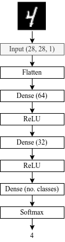
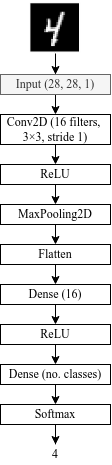

# Microcredencial AI Accelerators for Reconfigurable Technologies: Introduction to Accelerated Computing and Reconfigurable Technologies
## [Back to index](index.md)

This module introduces the fundamental concepts and practical workflow for developing and training Artificial Intelligence (AI) models based on Deep Learning. The process is demonstrated using both TensorFlow/Keras (Python) and MATLAB, focusing on the creation, training, and evaluation of neural networks for image classification tasks.

The MNIST handwritten digit dataset is used as the reference problem. It provides a clear and standardized environment for testing and comparing different network architectures and training configurations.

Two neural network architectures are implemented and analyzed:

1. Fully Connected Neural Network (FCNN)
Also known as a Multilayer Perceptron (MLP), this architecture connects every neuron in one layer to all neurons in the next. It is suitable for simple classification problems and serves as a foundation for understanding the basic operations of neural networks, including forward propagation, backpropagation, and loss optimization.

2. Convolutional Neural Network (CNN)
A specialized architecture for image processing tasks. It employs convolutional and pooling layers to extract spatial features directly from the input images, typically achieving improved performance and generalization in comparison to fully connected networks.

## Objectives:
- Understand the workflow for developing and training neural networks.
- Implement FCNN and CNN architectures using TensorFlow/Keras and MATLAB.
- Train both models on the MNIST dataset and evaluate their accuracy and loss.
- Compare the performance and efficiency between FCNN and CNN models.

## Notes:
- Input shape: (28, 28)
- Output: 10 neurons (digits 0–9)
- Use categorical cross-entropy as the loss function.
- Use Adam optimizer and accuracy as the metric.

## Train the network and report:
- Training/validation accuracy and loss
- Final test accuracy
- Inference time per image

## FCNN architecture
- Input Layer: accepts 28×28 grayscale MNIST images.
- Flatten Layer: converts each 2D image (28×28) into a 1D vector of 784 values.
- Fully Connected (Dense) Layer: 64 neurons.
- ReLU Activation: introduces nonlinearity.
- Fully Connected (Dense) Layer: 32 neurons.
- ReLU Activation: nonlinear transformation.r
- Fully Connected (Dense) Output Layer: 10 neurons (one per MNIST class).
- Softmax Activation: converts outputs into class probabilities.

<!--  -->

  

## CNN architecture
- Input Layer: accepts 28×28 grayscale MNIST images (1 channel).
- Conv2D Layer: 16 filters, kernel size 3×3, stride 1, ‘valid’ padding.
- ReLU Activation: nonlinear activation applied to feature maps.
- MaxPooling2D Layer: pool size (2×2) to reduce spatial dimensions.
- Flatten Layer: converts the 3D feature maps into a 1D vector.
- Fully Connected (Dense) Layer: 16 neurons.
- ReLU Activation: nonlinear transformation.
- Fully Connected (Dense) Output Layer: 10 neurons (one per MNIST class).
- Softmax Activation: outputs normalized class probabilities.

<!--  -->

  

## [Module 2.1: Introduction to TensorFlow](module2-aidev-tensorflow.md)
## [Module 2.2: Introduction to MATLAB](module2-aidev-matlab.md)
## [Module 2.3: Post-Training Quantization (PTQ) Tutorial with TensorFlow Lite](module2-aidev-ptq.md)
## [Module 2.4: Quantization-Aware Training (QAT) Tutorial with TensorFlow Lite](module2-aidev-qat.md)