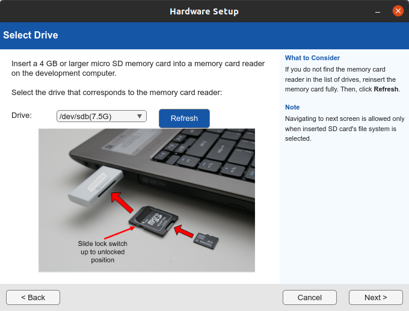

# Deploying a Neural Network on Intel Arria 10 SoC using MATLAB
## [Back to Module 4](module4-designflows.md)

This tutorial demonstrates how to deploy a fully connected (FC) neural network on an Intel Arria® 10 SX SoC Development Kit using MATLAB and the Deep Learning HDL Toolbox.
The process includes model import, FPGA bitstream configuration, network deployment, and inference execution on the target hardware.

## Prerequisites

The following software components must be installed before running the deployment:
- MATLAB
- Deep Learning HDL Toolbox
- Deep Learning Toolbox Converter for TensorFlow Models
- Deep Learning HDL Toolbox Support Package for Intel FPGA and SoC Devices
Reference:
[MathWorks: Get Started with Deep Learning FPGA Deployment to Intel Arria 10 SoC](https://mathworks.com/help/deep-learning-hdl/ug/get-started-with-deepl-learning-fpga-deployment-to-intel-arria10-soc.html)

## Hardware Setup

Prepare the Arria 10 SoC board with the appropriate bitstream:
- Bitstream: arria10soc_single
- Interface: Ethernet or JTAG

For Ethernet mode:
- Connect the board to the same LAN as the host PC.
- Default IP address: 192.168.1.101

Default credentials:
- Username: root
- Password: cyclonevsoc

For JTAG mode:
- Ensure Intel Quartus tools are available in the environment:
```
export PATH=/opt/FPGA/Intel/intelFPGA/21.1std/quartus/bin:$PATH
export LD_LIBRARY_PATH=/opt/FPGA/Intel/intelFPGA/21.1std/quartus/linux64:$LD_LIBRARY_PATH
```

## 1.SD Card Preparation

Before deploying the neural network, the SD card containing the Linux OS and MATLAB FPGA runtime tools must be created.
Open MATLAB and start the Deep Learning HDL Toolbox Support Package for Intel FPGA and SoC Devices hardware setup wizard.



Follow the steps to prepare the SD card and Arria 10 interface. insert the SD card into the Arria 10 SoC board. Connect the board via:
Ethernet, or USB Blaster / JTAG (for debugging or programming).

## 2. Neural Network model import
```matlab
model_path = 'saved_models/mnist_fc/model.h5';
net = importKerasNetwork(model_path);
info = analyzeNetwork(net);
```
Adapt the NN model to MATLAB and MATLAB DL HDL environment. In this example, the final layer is replaced with a classification layer that supports digit classes (0–9)::
```matlab
correctClasses = string(0:9);
newClassificationLayer = classificationLayer('Classes', categorical(correctClasses), 'Name', 'output');
layers = net.Layers;
layers(end) = newClassificationLayer;
net = assembleNetwork(layers);
```

## 3. Target configuration
### a) Ethernet interface
```matlab
hTarget = dlhdl.Target('Intel','Interface','Ethernet','IPAddress','192.168.1.101', ...
                       'Username','root','Password','cyclonevsoc');
```
### a) JTAG interface
```matlab
setenv('PATH', ['/opt/FPGA/Intel/intelFPGA/21.1std/quartus/bin:' getenv('PATH')]);
setenv('LD_LIBRARY_PATH', '/opt/FPGA/Intel/intelFPGA/21.1std/quartus/linux64']);
hTarget = dlhdl.Target('Intel','Interface','JTAG');
```
## 4. Compilation and Deployment
The network is compiled:
```matlab
hW = dlhdl.Workflow('network', net, ...
                    'Bitstream', 'arria10soc_single', ...
                    'Target', hTarget);
dn = hW.compile;
hW.deploy;
```
Output
```
NetworkAnalysis with properties:​

    TotalLearnables: 52650​
          LayerInfo: [9×7 table]​
             Issues: [0×3 table]​
          NumErrors: 0​
        NumWarnings: 0​
       AnalysisDate: 05-Nov-2025 18:42:40

### Compiling network for Deep Learning FPGA prototyping ...​
### Targeting FPGA bitstream arria10soc_single.​
### Optimizing network: Flatten layer ('flatten_2'), removed and fused into FC layer ('dense_6'). ​
### The weights of the FC layer were modified to account for the flatten layer removal.​
### The network includes the following layers:​

     1   'flatten_2_input'   Image Input             28×28×1 images                               (SW Layer)​
     2   'dense_6'           Fully Connected         64 fully connected layer                     (HW Layer)​
     3   're_lu_4'           ReLU                    ReLU                                         (HW Layer)​
     4   'dense_7'           Fully Connected         32 fully connected layer                     (HW Layer)​
     5   're_lu_5'           ReLU                    ReLU                                         (HW Layer)​
     6   'dense_8'           Fully Connected         10 fully connected layer                     (HW Layer)​
     7   'Softmax1'          Softmax                 softmax                                      (SW Layer)​
     8   'output'            Classification Output   crossentropyex with '0' and 9 other classes  (SW Layer)​
                                                                                               ​
### Notice: The layer 'flatten_2_input' with type 'nnet.cnn.layer.ImageInputLayer' ​is implemented in software.​
### Notice: The layer 'Softmax1' with type 'nnet.cnn.layer.SoftmaxLayer' is implemented in software.​
### Notice: The layer 'output' with type 'nnet.cnn.layer.ClassificationOutputLayer' ​is implemented in software.​
### Compiling layer group: dense_6>>dense_8 ...​
### Compiling layer group: dense_6>>dense_8 ... complete.
### Allocating external memory buffers:​

          offset_name          offset_address     allocated_space
   _______________________    ______________    __________________​
    "InputDataOffset"           "0x00000000"     "368.0 kB"        ​
    "OutputResultOffset"        "0x0005c000"     "4.0 kB"          ​
    "SchedulerDataOffset"       "0x0005d000"     "0.0 kB"          ​
    "SystemBufferOffset"        "0x0005d000"     "20.0 kB"         ​
    "InstructionDataOffset"     "0x00062000"     "4.0 kB"          ​
    "FCWeightDataOffset"        "0x00063000"     "796.0 kB"        ​
    "EndOffset"                 "0x0012a000"     "Total: 1192.0 kB"​

### Network compilation complete.
```
and deployed to the FPGA using the specified bitstream:
```
### Programming FPGA Bitstream using Ethernet...​
### Attempting to connect to the hardware board at 192.168.1.101...​
### Connection successful​
### Programming FPGA device on Intel SoC hardware board at 192.168.1.101...​
### Attempting to connect to the hardware board at 192.168.1.101...​
### Connection successful​
### Copying FPGA programming files to SD card...​
### Setting FPGA bitstream and devicetree for boot...​
WARNING: Uboot script u-boot.scr detected, this may override boot settings​
# Copying Bitstream arria10soc_single.core.rbf to /mnt/hdlcoder_rd​
# Set Bitstream to hdlcoder_rd/arria10soc_single.core.rbf​
# Copying Devicetree devicetree_dlhdl.dtb to /mnt/hdlcoder_rd​
# Set Devicetree to hdlcoder_rd/devicetree_dlhdl.dtb​
# Set up boot for Reference Design: 'LIBIIO CNN system with 3 AXI4 Master'​
### Rebooting Intel SoC at 192.168.1.101...​
### Reboot may take several seconds...​
### Attempting to connect to the hardware board at 192.168.1.101...​
### Connection successful​
### Programming the FPGA bitstream has been completed successfully.​
### Loading weights to FC Processor.​
### 50% finished, current time is 05-Nov-2025 18:50:21.​
### FC Weights loaded. Current time is 05-Nov-2025 18:50:21
```
## 5. Test Data Loading (MNIST)
The MNIST dataset is used to test the deployed network:

```matlab
test_images_file  = 'data/t10k-images.idx3-ubyte';
test_labels_file  = 'data/t10k-labels.idx1-ubyte';
test_data = loadMNISTImages(test_images_file);
test_labels = loadMNISTLabels(test_labels_file);

test_data = reshape(test_data, 28, 28, []);
test_labels_cat = categorical(test_labels);
```
## 6. Hardware Inference
Inference is executed on the FPGA using a defined number of test samples:

```matlab
numSamples = 10;
correct = 0;

for i = 1:numSamples
    data = test_data(:,:,i);
    [prediction, speed] = hW.predict(data,'Profile','on');
    [~, pred_idx] = max(prediction);
    pred_idx = pred_idx - 1;
    pred_label = categorical(string(pred_idx));
    true_label = test_labels_cat(i);

    if pred_label == true_label
        correct = correct + 1;
    end
end

acc = correct / numSamples;
fprintf('Hardware accuracy: %.2f%%\n', acc * 100);
```

## Results
After successful deployment, the output includes:
- Prediction latency per inference
- Hardware-based classification accuracy
- Optional profiling information when 'Profile','on' is enabled
Example output:
```
prediction =​
  1×10 single row vector​
    0.0000    0.0000    0.0000    0.0000    0.0046    0.0000    0.0000    0.0002    0.0003    0.9950

### Finished writing input activations.​
### Running single input activation.​

              Deep Learning Processor Profiler Performance Results​

              LastFrameLatency(cycles)   LastFrameLatency(seconds)   FramesNum  Total Latency   Frames/s​
                   -------------             -------------          ---------    ---------     ---------​
Network                 17653                  0.00012                   1          18121         8277.7​
    dense_6             17368                  0.00012 ​
    dense_7               160                  0.00000 ​
    dense_8               123                  0.00000 ​

* The clock frequency of the DL processor is: 150MHz
```

## Notes 
- The bitstream file arria10soc_single must match the FPGA hardware configuration.
- A custom dlprocessor can be built to change dlprocessor performance and resource usage as well as for another target platform.
- The design may fail to fit if it exceeds FPGA resource limitations.
- Consistent MATLAB and Intel FPGA SDK versions are required for reproducibility.
- In case of JTAG connection errors, the Quartus toolchain paths should be verified.

## This deployment process includes:

1. Importing and adapting a Keras/TensorFlow model
2. Configuring an Intel Arria 10 SoC FPGA target via Ethernet or JTAG
3. Compiling and deploying the network to the FPGA
4. Executing inference on hardware with MNIST test data
5. Measuring accuracy and inference latency