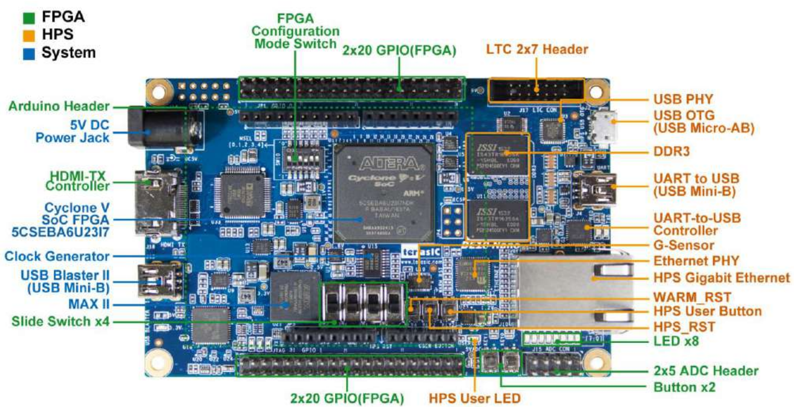

# Deploying Accelerator on a FPGA with OpenCL and Intel SDK for OpenCL
## [Back to Module 4](module4-designflows.md)

This section explains how to deploy, run, and measure performance of your OpenCL kernels (Fully Connected and CNN models) on the DE10-Nano SoC board using the Intel FPGA SDK for OpenCL runtime.

---

## 1. Export Model Weights
Before running the models on FPGA, export trained model weights from your TensorFlow/Keras models using the provided Python scripts:
```
python3 src/py/export_fc_fp32_weights.py
python3 src/py/export_cnn_fp32_weights.py
```
Weights will be saved in binary format under the following structure:
```
weights
├── cnn_fp32
│   ├── conv0_b.bin
│   ├── conv0_W.bin
│   ├── fc1_b.bin
│   ├── fc1_W.bin
│   ├── fc2_b.bin
│   └── fc2_W.bin
└── fc_fp32
    ├── fc0_b.bin
    ├── fc0_W.bin
    ├── fc1_b.bin
    ├── fc1_W.bin
    ├── fc2_b.bin
    └── fc2_W.bin
```
These binary files will be loaded by the OpenCL host application on the ARM processor of the DE10-Nano.

## 2. Prepare the DE10-Nano SoC System
### Step 2.1. Flash the OpenCL SD Image
Download and flash the de10_nano_opencl.img SD card image using one of the following tools:

Windows: Rufus or Balena Etcher
Linux (CLI):
```
sudo dd if=de10_nano_opencl.img of=/dev/sdX bs=4M status=progress conv=fsync
```
### Step 2.2. Configure Boot Mode
Set DIP switch SW10 to: ```MSEL[4:0] = 01010```

<p align="center">
  
</p>

This configures the board to boot from the SD card.
### Step 2.3. Connect and Power On
- Insert the SD card into the DE10-Nano
- Connect the UART-to-USB cable to your PC

<p align="center">
  
</p>

- Open a serial terminal (e.g., PuTTY, minicom, hterm) using:

```
Baud rate: 115200
Data bits: 8
Parity: None
Stop bits: 1
Flow control: None
```
- Power on the board and verify Linux boots successfully. You should see a Linux shell prompt via the serial terminal.
>>In Linux, to access serial devices such as /dev/ttyUSB0, you must either:
>> 1. Run minicom with sudo privileges, or
>> 2. Add your user to the dialout group, which grants access to serial ports and reboot the system:
>>```
>>sudo usermod -a -G dialout $USER
>>```

>>To use minicom:
>>```
>>minicom -D /dev/ttyUSB0 -b 115200
>>```

>> Linux user: ```root```

## 3. Deploy and Run the OpenCL Applications
### Step 3.1. Verify OpenCL Runtime

From the DE10-Nano terminal:
```
source ./init_opencl.sh
aocl diagnose
```
Expected output:
```
aocl diagnose: Running diagnostic from /home/root/opencl_arm32_rte/board/c5soc/arm32/bin                                                               
                                                                                                                                                       
Verified that the kernel mode driver is installed on the CycloneV SoC system.                                                                                 
                                                                                                                                                       
Using platform: Intel(R) FPGA SDK for OpenCL(TM)                                                                                                       
Board vendor name: Intel(R) Corporation                                                                                                                
Board name: de10_nano_sharedonly : Cyclone V SoC Development Kit                                                                                       
                                                                                                                                                       
Buffer read/write test passed.                                                                                                                         
                                                                                                                                                       
DIAGNOSTIC_PASSED
```
If you see DIAGNOSTIC_PASSED, your OpenCL runtime is correctly installed.
## 4. Transfer Files to the Board

Perare data according to the suggested folder structure. The folder structure must be similar to the following one:

```
opencl
├── apps
│   ├── cnn_fp32_host
│   └── fc_fp32_host
├── data
│   ├── test_images_u8_10.bin
│   ├── test_images_u8.bin
│   ├── test_labels_10.bin
│   └── test_labels.bin
├── host
│   ├── main_cnn_fp32.cpp
│   └── main_fc_fp32.cpp
├── kernels
│   ├── cnn_fp32.aocx
│   ├── cnn_fp32_unroll4.aocx
│   ├── fc_fp32.aocx
│   ├── fc_fp32_unroll4.aocx
│   └── fc_fp32_unroll8.aocx
└── weights
    ├── cnn_fp32
    │   ├── conv0_b.bin
    │   ├── conv0_W.bin
    │   ├── fc1_b.bin
    │   ├── fc1_W.bin
    │   ├── fc2_b.bin
    │   └── fc2_W.bin
    └── fc_fp32
        ├── fc0_b.bin
        ├── fc0_W.bin
        ├── fc1_b.bin
        ├── fc1_W.bin
        ├── fc2_b.bin
        └── fc2_W.bin

```


Transfer data to the SD card. You can use minicom with xmodem or SD card copy.
### Option 1: Using tar.gz and minicom

On your PC:
```
tar czvf opencl.tar.gz opencl/
```
In minicom (on the DE10-Nano terminal):
```
rx opencl_deploy.tar.gz
```
Then extract on the board:
```
tar xzvf opencl_deploy.tar.gz
```
### Option 2: Copy via SD Card
If your host PC OS runs a Linux OS, you can copy the ``òpencl```folder into the ```/home/root/```directory.

## 5. Compile the Host Applications
Compile the host applications (for both FC and CNN models) for the ARM processor.

Fully Connected Host:
```
g++ -O2 -std=c++11 opencl/host/main_fc_fp32.cpp -o opencl/apps/fc_fp32_host \
  $(aocl compile-config) \
  $(aocl link-config)
```
CNN Host:
```
g++ -O2 -std=c++11 opencl/host/main_cnn_fp32.cpp -o opencl/apps/cnn_fp32_host \
  $(aocl compile-config) \
  $(aocl link-config)
```

## 6. Program the FPGA and Run the FC Model

Run:
```
opencl/apps/fc_fp32_host \
  opencl/kernels/fc_fp32.aocx \
  opencl/data/test_images_u8.bin \
  opencl/data/test_labels.bin \
  opencl/weights/fc_fp32
```
Example Output:
```
[INFO] Batch: 10000 images (u8).
Reprogramming device [0] with handle 1
[  0] pred=7 label=7 time=0.423 ms -> OK
[  1] pred=2 label=2 time=0.372 ms -> OK
[  2] pred=1 label=1 time=0.363 ms -> OK
[  3] pred=0 label=0 time=0.362 ms -> OK
[  4] pred=4 label=4 time=0.359 ms -> OK
[  5] pred=1 label=1 time=0.356 ms -> OK
[  6] pred=4 label=4 time=0.359 ms -> OK
[  7] pred=9 label=9 time=0.358 ms -> OK
[  8] pred=6 label=5 time=0.357 ms -> FAIL
...

```
Performance summary:
```
[RESULT] Accuracy = 97.050%  (9705/10000)                                                                                                                        
[RESULT] Average kernel inference time = 0.359 ms  (min=0.355 ms, max=2.695 ms)  
```

## 7. Measure Performance and Latency
Measure preformance and latency for all the developed kernels and provide a summary table with the resuls.